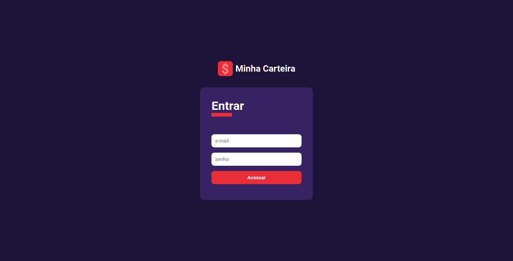
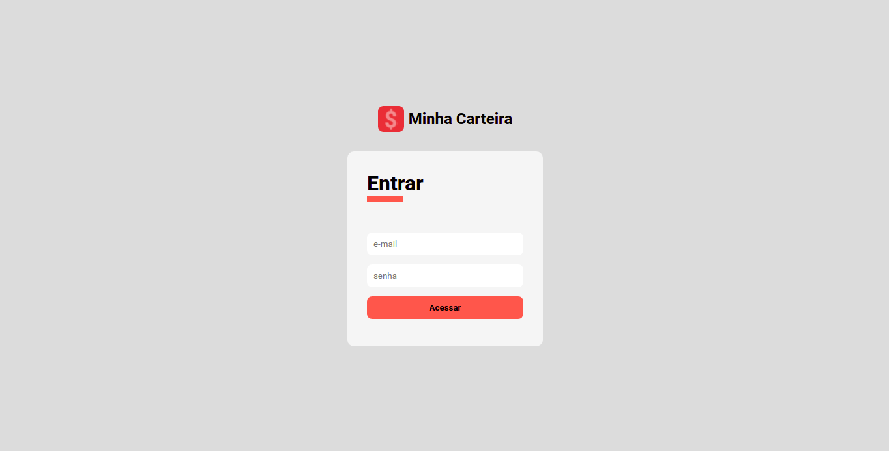
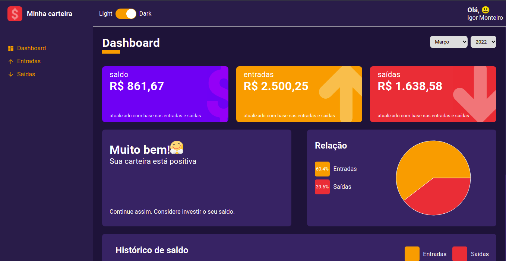
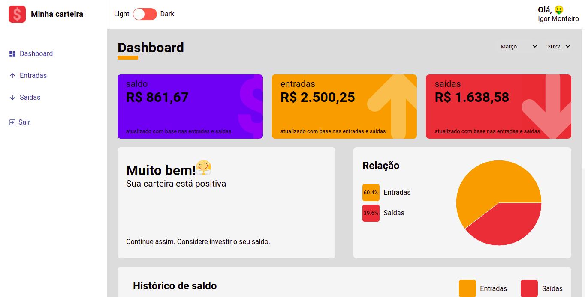
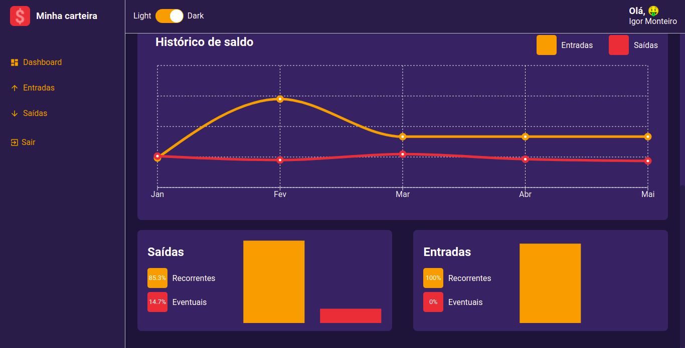
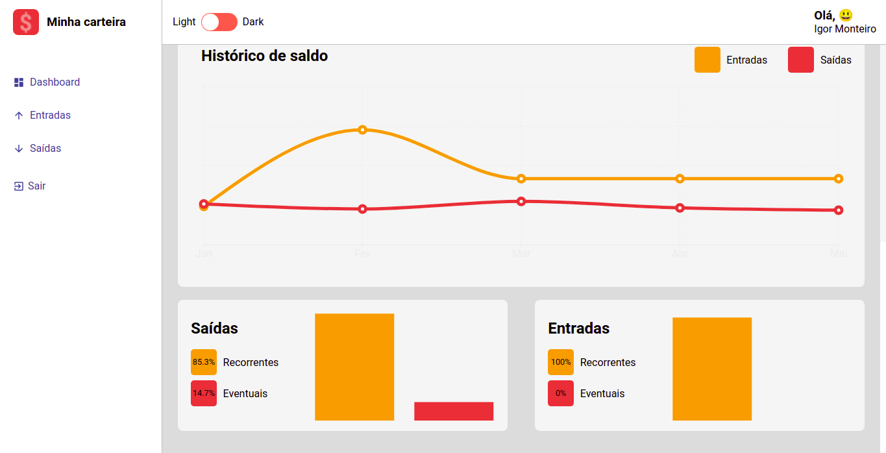
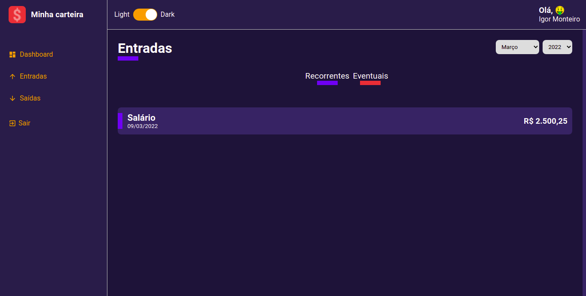
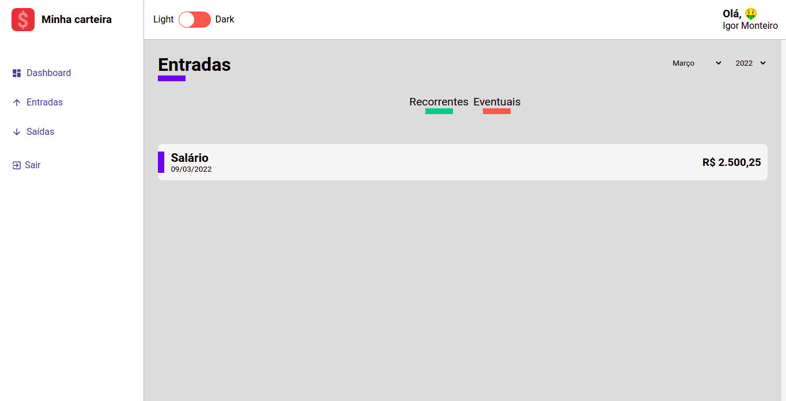
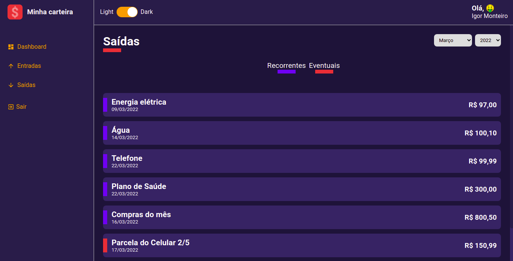
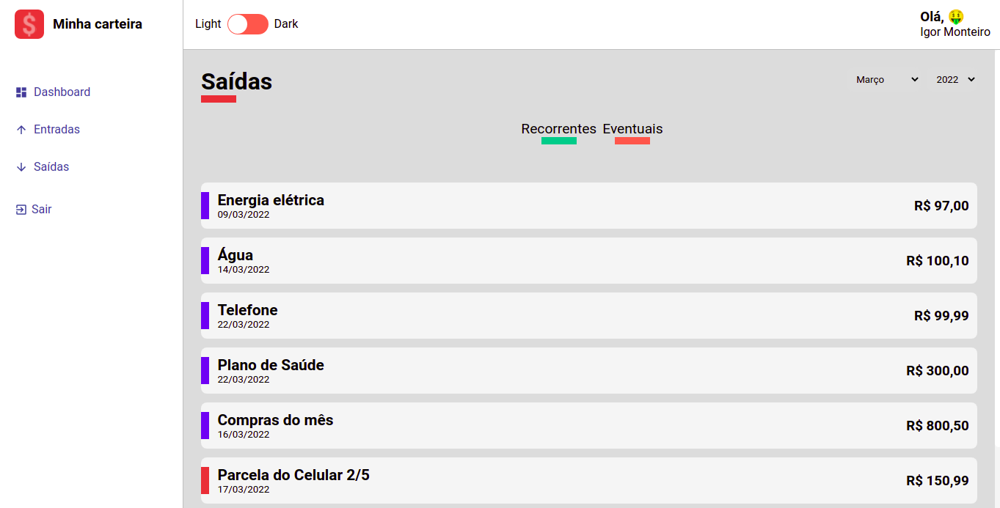

    
    <h1>Minha Carteira</h1>

<h3 align="center">Dashboard para controle dos seus gastos! 🚀</h3>

<h2> 🛠 Tecnologias </h2>

Essas foram as ferramentasusadas na implementação desse projeto:

- [React](https://pt-br.reactjs.org/)
- [TypeScript](https://www.typescriptlang.org/)
- [Recharts](https://recharts.org/en-US/)
- [Styled-components](https://styled-components.com/)

<h2> 🛠 Features </h2>

Alguns recursos do projeto:

- Toggle theme - Dark/Light
- Filtragem de entradas e saídas através do mês e ano
- Verificação da situação da carteira
- 3 tipos de gráficos mostrando as relações de entrada e saída
- Sistema totalmente responsivo utilizando como ferramenta o Responsively

<h2>Visão geral do projeto</h2>

- SingIn

  
  

- Dashboard

  
  

  
  

- Entradas/Saídas

  
  

  
  

  💜

